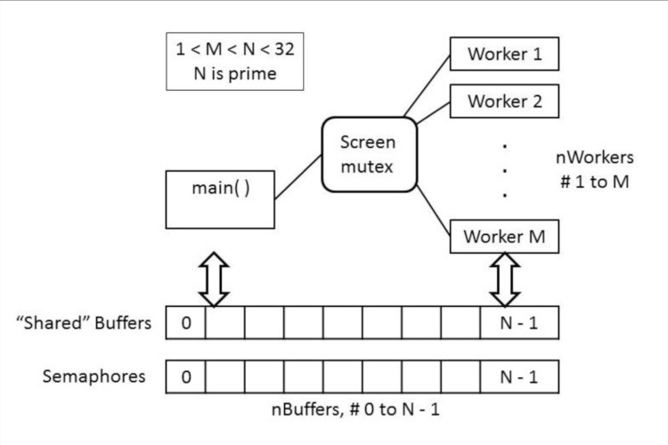
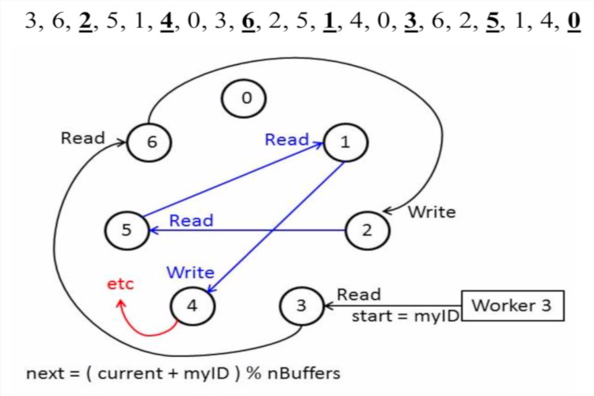
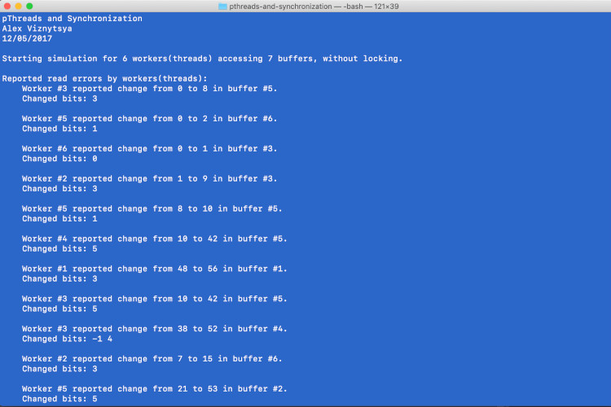
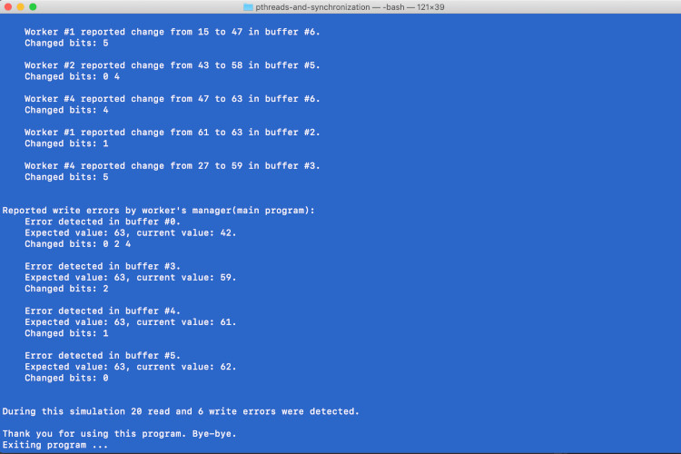
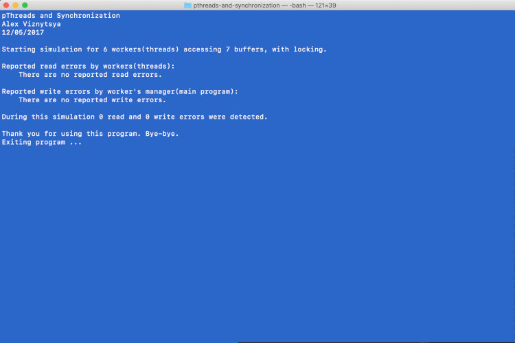

# pthreads-and-synchronization
pThreads and Synchronization

This application is a simulation in which a number of threads access a group of shared buffers for both reading and writing purposes. Initially this is done without the benefit of synchronization tools (semaphores) to illustrate the problems of race conditions, and then with the synchronization tools to solve the problems. Also separate mutex is used to coordinate writing to the screen.



Each worker performs a sequence of read and write operations on the shared buffers, simulating the memory accesses performed by the simple statement “A = B + C;”, i.e. ( fetch B, fetch C, store A ). However it is not actually add up the buffer contents. Instead it accesses the buffers in the following manner (where nBuffers and nWorkers correspond to M and N in the diagram above): 
- The first buffer accessed will be the worker's ID number, e.g. buffer[3] for worker 3.
- Successive accesses will jump by steps of the worker's ID number, in a circular fashion. Worker number 3 will access every 3rd buffer, worker number 5 will access every 5th buffer, etc., wrapping back to zero on a mod basis when the numbers exceed nBuffers - 1.
- The first two accesses of every three will be for reading, and the third for writing.
- The cycle continues until each worker has written into nBuffers of the buffers, which should involve writing into each buffer exactly once, ( 3 * nBuffers total accesses), since nBuffers is prime and nWorkers must be strictly less than nBuffers.
- So for example, if nBuffers = 7, then the order of access for worker number 3 would be as follows, where the underlined numbers are write access and the others are reads (Note that every buffer gets written into exactly once, and read from exactly twice, by each worker).



A read operation consists of the following steps:
- Read the initial value in the buffer.
- Sleep for sleepTime seconds, where sleepTime is the random sleep time assigned to this worker.
- Read the value of the buffer again, and print a message to the screen if the value changed while the worker was sleeping. The message includes the ID of the worker that detected the error, the buffer which changed, the initial value, and the final value.

A write operation consists of the following steps:
- Read the initial value of the buffer.
- Sleep for sleepTime seconds.
- Add 1 << ( ID – 1 ) to the value read initially, and store the result back into the buffer. ( E.g. worker number 3 adds binary 000001 shifted left 2 places = 000100 = 4. Worker 4 adds 8, worker 5 adds 16, etc. ) Each worker will add a single binary bit in a different position, which make it possible to later identify which worker(s) were involved in any error conditions that erased write operations.

Program compilation:
Use command "make" to compile program. This will compile one file:
	raceTest

*Note: this program was written using c+11 standards so for manual compilation  
- use --std=c++11 parameter.  
- In case of compilation error on your system please uncomment this part of code: 
    ```
    #if defined(__GNU_LIBRARY__) && !defined(_SEM_SEMUN_UNDEFINED)
      
    #else 
    union semun {
        int val;
        struct semid_ds *buf;
        unsigned short *array;
        struct seminfo *__buf;
    };
    #endif
    ```

Program usage:  
- To run program type "./raceTest nBuffers nWorkers [ sleepMin sleepMax ] [ randSeed ] [ -lock | -nolock ]"

Example:   
- ./raceTest 7 6 0.1 0.5 -nolock





- ./raceTest 7 6 0.1 0.5 -lock



Program error codes:  
- "-1"  - Wrong program argument.
- "-3"  - semget().
- "-4"  - semctl().
- "-5"  - Free shared resources.
- "-6"  - semop().
